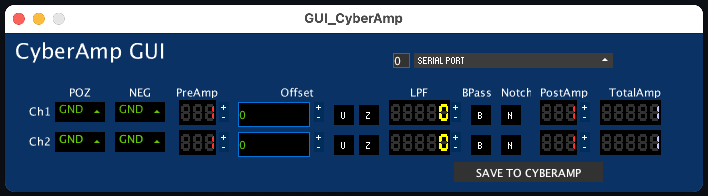
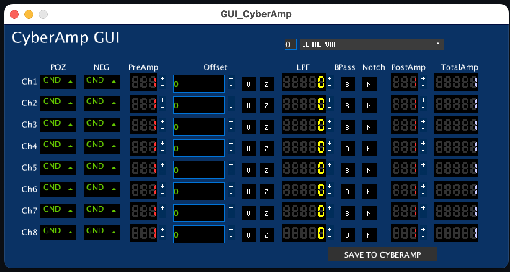

# GUI_CyberAmp
A Graphical User Interface for CyberAmp 320 and CyberAmp 380 as the CyberAmp Control program does not work on newer versions of Windows. The manual for CyberAmp380 was downloaded from [docplayer]. This GUI uses the command from the "Programmer's Guide" section in the manual (page 94 in the document). Not all commands are used at this moment, the diagnostics are ommitted. This GUI allows for signal conditioning and amplification. Probes are not supported.

## Table of content
* [Technologies](#technologies)
* [Setup and Launch](#setup-and-launch)
* [How to use](#how-to-use)

## Technologies
- ATEN USB to RS-232 Adapter (UC232A) [ATEN-website]
- CyberAmp 380 (8 channel)
- NAME adaptor
- Windows 10
- [Processing] with ControlP5 and G4P libraries

## Setup and Launch
- ATEN Adapter settings (Device Manager > Ports (COM & LPT) > ATEN USB to Serial Bridge (COM 7)):
    Setting | Value
    --- | ---
    Driver | 3.8.15.5 (02/10/2017)
    Bits per second | 9600
    Data bits | 8
    Parity | None
    Stop bits | 1
    Flow control | None
    
- Install Processing
    - Install libraries (Sketch > Import Library... > Add Library > search for "controlP5" and Install)

- Download the repository, open "GUI_CyberAmp.pde" in Processing 
- Set the Nch to 2 or 8, depending on the CyberAmp used
- Sketch > Run or Export as an application and run that

## How to use
Nch set to 2 is used for CyberAmp320:

Nch set to 8 is used for CyberAmp380:

The first thing to do is select the device address, which can be in the range from 0 to 9. Input the correct value in the textField next to the Serial port dropdown menu. The value is red if it has not yet been updated.
Then we need to connect to the appropriate Serial COM port (that was COM 7 in this example  [Setup and Launch](#setup-and-launch)) by selecting the correct one from the "Serial port" drop-down menu. If a correct device is selected the GUI will query the CyberAmp for current values and update every channel to the last stored values in the CyberAmp.

The bottom-right "Save to CyberAmp" button stores the current values to the CyberAmp (writen to a non-volatile memory).

If we desire to connect to another device on the same port we need to change the address value, then we have to select the same port from the drop-down menu, which will update the address and query the other CyberAmp device for values.

We can use the same window of the GUI for more than one device, while using sepparate instances is better, faster and presents all the information at once. 

The schematics for each channel can be found on page 6 of the "CyberAmp 380 operator's manual" and it will help in understanding the categories of the GUI:

 - POZ and NEG select the coupling of the + and - inputs, respectively
 - PreAmp is the pre-filter amplifier
 - Offset in microvolts with "+", "-", Update and Zero buttons
    - Update is used when the user inputs a new value and wants to send it to the device
    - "+" and "-" will change the current Offset value as well as update it
    - Zero will zero-offset the channel if possible
- LPF is the Low Pass Filter
- Notch filter selection toggle button
- PostAmp is the output amplifier
- TotalAmp reports the total amplification of the signal

### Make an executable program
To avoid the need of oppening the GUI from Processing you can Export an Applicaition:
Processing > File > Export Application... and follow the instructions there.

### Advanced use
There is a "DEBUG" boolean in "GUI_CyberAmp.pde" that can be changet to "true" which will enable a text field which can be accessed with the mouse or by the TAB key. One can write a command and send it with the ENTER key to the device. If running the GUI from Processing any echo from CyberAmp should be in the Console. There is no echo visible in an Exported Application.

## Future ideas
- user definable colours
- implementation of other commands in the Programmer's Guide
- query for overload reports and show in the GUI (there is a LED on the front panel of the device that shows the status as well)

[docplayer]: https://docplayer.fr/155872871-Cyberamp-380-operator-s-manual.html
[ATEN-website]: https://www.aten.com/global/en/products/usb-&-thunderbolt/usb-converters/uc232a/
[Processing]: https://processing.org/
